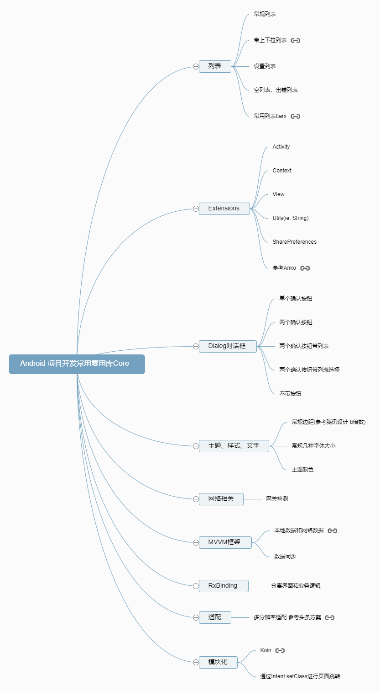

# Rx-MVVM
Kotlin + RxBinding + Rxjava + MVVM + Koin

#### 基于Google Android Architecture Component组件设计的MVVM架构

#### 主要分为三层，如下图所示：

##### 由上图可以清晰的看到，整个架构三层分层（DAL层(数据访问层)， DLL层(业务逻辑层)， UI层(表现层)） 十分的清晰明了，各层各司其职，

##### 1. UI层，UI层主要负责视图的显示，不应包含任何业务逻辑的操作，并且UI层不能跨层去访问数据层。

##### 2. ViewModel层（DLL层），主要负责业务逻辑的处理和数据层数据的分发，不应持有View层的任何引用。

##### 3. Repository层（DAL层）， 主要负责数据的处理，包括数据的请求、缓存等。

#### 一、本框架核心组件core的各个目录解析

api         接口相关
    
        APIException                            针对于后台接口的错误统一处理为APIException
        APIService                              具体的项目接口定义
base        基类
        
        view
                BaseActivity                
                BaseViewModel
        response
                BaseResponse                    基本数据类
              
di          注入
        
        module                                  
                NetworkModule                   网络相关单例
                
extensions   扩展

        context
                ContextExtension
        rxjava
                RxJavaExtension
        view
                ViewExtension
                
model   数据实体类
        
        Responses                                针对于后台接口返回数据统一处理类

utils    工具类

vo  核心组件
        
        NetworkBoundResource

widget  自定义控件

#### 二、使用说明

   1.新建工程并引入core module添加App ActivityLauncherHelper AppModule三个文件        
 
   1.1 App 自定义Application 初始化DI库Koin， 在onCreate中初始化
   
        //init DI
        startKoin {
            logger(AndroidLogger())
            androidContext(this@App.applicationContext)
            //modules(appModule)
        }
            
   1.2 ActivityLauncherHelper 模块化跳转Router 所有界面的绝对路径定义
         
        private const val packageName = BuildConfig.APPLICATION_ID
        fun startTo(activity: Activity, addressableActivity: AddressableActivity, body: Intent.() -> Unit) {
            activity.startActivity(Intent().setClassName(packageName, addressableActivity.className).apply(body))
        }
        
        interface AddressableActivity{
            val className: String
        }
        
        object Activities {
            object Login: AddressableActivity {
                override val className: String = "$packageName.LoginActivity"
            }
            object Main: AddressableActivity {
                override val className: String = "$packageName.MainActivity"
            }
            object WebView: AddressableActivity {
                override val className: String = "$packageName.WebViewActivity"
            }
        }
   1.3 AppModule 初始化依赖项 并加入networkModule网络依赖(全局使用)
   
        val splashModule = networkModule + module {
            viewModel { SplashViewModel() }
        }
            
2.新建各个模块 通过Dynamic Feature Module创建

        di                                  注入声明
        repository                          数据层处理
      
      这里注意一点：各个模块的注入记得，都是全局的，所以只需要在模块的入口处注入就可以了，
      然后注入时声明需要是全局的，这样防止多次注入或者旋转屏幕时再次注入出错。
      全局声明：private val loadMainModule by lazy { loadKoinModules(mainModule) }
      然后复写 override fun initKoinModule() = loadMainModule
      即注入完成。 
      其他非入口类的复写override fun initKoinModule() = Unit

3.根据项目数据结构修改BaseResponse

        data class BaseResponse<T>(
            @SerializedName("error") var code: Boolean,
            @SerializedName("results") var data: T
        )
  同时会涉及到NetworkBoundResource的一些对应修改，根据修改BaseResponse后对应修改即可。
  
#### 三、开发中常用库整理
      
 [Koin](https://github.com/InsertKoinIO/koin)
 
 [RxBinding](https://github.com/JakeWharton/RxBinding)
 
 [RxJava](https://github.com/ReactiveX/RxJava)
 
 [RxAndroid](https://github.com/ReactiveX/RxAndroid)
 
 [RxKotlin](https://github.com/ReactiveX/RxKotlin)
      
 [Retrofit](https://github.com/square/retrofit)
 
 开发常用库积累
 
 

 
 
 
                 
